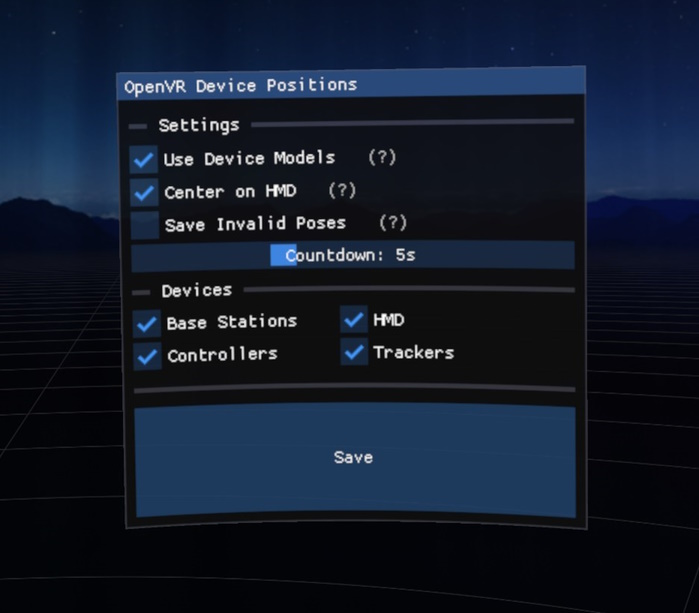

# OpenVR Device Positions

A tool to save the positions and rotations of tracked devices in SteamVR to an FBX file

Features:

- Save with placeholder models or device models grabbed from SteamVR
- Optional countdown, letting you get into the right pose before saving
- Choose which devices to include/exclude from saving
- Help text
- Easter egg for a friend :)

Screenshots:

Desktop window

VR overlay

